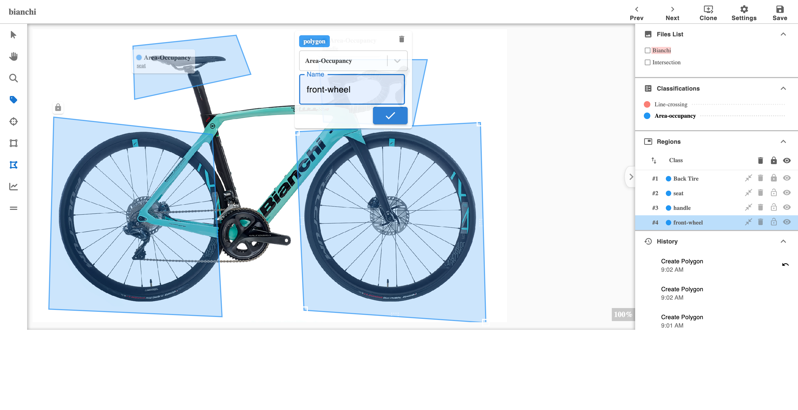

# Annotation-Lab

Annotation-Lab is a web application designed for image annotation. It consists of two main parts: the client and the server. The client is a React application responsible for the user interface, while the server is a Flask application that handles the backend logic.



<br/>


## Table of Contents
- [Project Structure](#project-structure)
- [Dependencies](#dependencies)
- [Setup and Installation](#setup-and-installation)
- [Running the Application](#running-the-application)
- [Usage](#usage)
- [Troubleshooting](#troubleshooting)
- [Contributing](#contributing)
- [License](#license)

## Project Structure
```sh

annotation-lab/
├── client/
│   ├── public/
│   ├── src/
│   ├── package.json
│   ├── package-lock.json
│   └── ... (other React app files)
├── server/
│   ├── db/
│   ├── venv/
│   ├── app.py
│   ├── requirements.txt
│   └── ... (other Flask app files)
├── README.md
```


### Client
- **public/**: Static files and the root HTML file.
- **src/**: React components and other frontend code.
- **package.json**: Contains client dependencies and scripts.

### Server
- **db/**: Database-related files and handlers.
- **venv/**: Python virtual environment (not included in version control).
- **app.py**: Main Flask application file.
- **requirements.txt**: Contains server dependencies.

## Dependencies

### Client
- React
- Axios
- Other dependencies as listed in `package.json`

### Server
- Flask
- Flask-CORS
- pandas
- Other dependencies as listed in `requirements.txt`

## Setup and Installation

### Client Setup
1. Navigate to the `client` directory:
   ```sh
   cd client
    ```
2. Install the dependencies:
    ```sh
   npm install
    ```
### Server Setup
1. Navigate to the `server` directory:
   ```sh
   cd server
    ```
2. Create and activate a virtual environment:
    ```sh
   python3 -m venv venv

    source venv/bin/activate  # On Windows use `venv\Scripts\activate`
    ```
3. Install the dependencies:
```sh
   pip install -r requirements.txt
```

## Running the Application

### Running the Client
1. Navigate to the `client` directory:
   ```sh
   cd client
    ```
2. Install the dependencies:
    ```sh
   npm start
   ```
The application should now be running on [http://localhost:5173](http://localhost:5173).


### Running the Server
1. Navigate to the `server` directory:
   ```sh
   cd server
    ```
2. Activate the virtual environment:
    ```sh
   source venv/bin/activate  # On Windows use `venv\Scripts\activate`
   ```
3. Start the Flask application:
   ```sh
   flask run
    ```
The server should now be running on [http://localhost:5000](http://localhost:5000).


## Usage

1. Open your web browser and navigate to [http://localhost:5173](http://localhost:5173).
2. Use the user interface to upload and annotate images.
3. The annotations and other interactions will be handled by the Flask server running at [http://localhost:5000](http://localhost:5000).

## Troubleshooting

- Ensure that both the client and server are running.
- Check the browser console and terminal for any errors and troubleshoot accordingly.
- Verify that dependencies are correctly installed.

## Contributing

If you would like to contribute to this project, please fork the repository and submit a pull request. For major changes, please open an issue first to discuss what you would like to change.

## License

This project is licensed under the MIT License.

## Acknowledgment

This project is built on top of idapgroup [react-image-annotate](https://github.com/idapgroup/react-image-annotate) and [image_annotator](https://github.com/gnamiro/image_annotator/tree/master) package with customizations.
