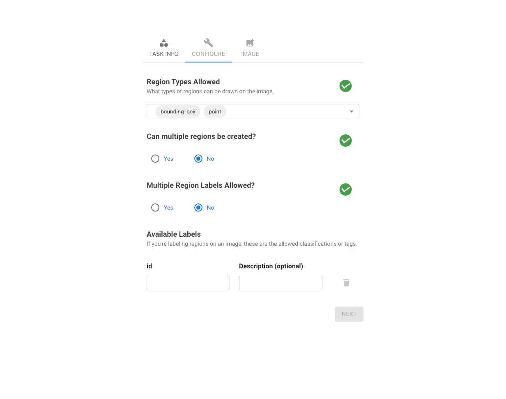

# Annotate-Lab

Annotate-Lab is an open-source application designed for image annotation, comprising two main components: the client and the server. The client, a React application, is responsible for the user interface where users perform annotations. On the other hand, the server, a Flask application, manages persisting the annotated changes and generating masked and annotated images, along with configuration settings. More information can be found in our [documentation](./docs/annotate-lab.md).


# Demo 
[](https://www.youtube.com/watch?v=b78BJhbasVw)


<br/>


## Table of Contents
- [Project Structure](#project-structure)
- [Dependencies](#dependencies)
- [Setup and Installation](#setup-and-installation)
- [Running the Application](#running-the-application)
- [Usage](#usage)
- [Outputs](#outputs)
- [Troubleshooting](#troubleshooting)
- [Contributing](#contributing)
- [License](#license)

## Project Structure
```sh

annotation-lab/
├── client/
│   ├── public/
│   ├── src/
│   ├── package.json
│   ├── package-lock.json
│   └── ... (other React app files)
├── server/
│   ├── db/
│   ├── venv/
│   ├── app.py
│   ├── requirements.txt
│   └── ... (other Flask app files)
├── README.md
```


### Client
- **public/**: Static files and the root HTML file.
- **src/**: React components and other frontend code.
- **package.json**: Contains client dependencies and scripts.

### Server
- **db/**: Database-related files and handlers.
- **venv/**: Python virtual environment (not included in version control).
- **app.py**: Main Flask application file.
- **requirements.txt**: Contains server dependencies.

## Settings
One can configure the tools, tags, upload images and do many more from the settings.


## Dependencies

### Client
- React
- Axios
- Other dependencies as listed in `package.json`

### Server
- Flask
- Flask-CORS
- pandas
- Other dependencies as listed in `requirements.txt`

## Setup and Installation

### Client Setup
1. Navigate to the `client` directory:
   ```sh
   cd client
    ```
2. Install the dependencies:
    ```sh
   npm install
    ```
### Server Setup
1. Navigate to the `server` directory:
   ```sh
   cd server
    ```
2. Create and activate a virtual environment:
    ```sh
   python3 -m venv venv

    source venv/bin/activate  # On Windows use `venv\Scripts\activate`
    ```
3. Install the dependencies:
```sh
   pip install -r requirements.txt
```

## Running the Application

### Running the Client
1. Navigate to the `client` directory:
   ```sh
   cd client
    ```
2. Install the dependencies:
    ```sh
   npm start
   ```
The application should now be running on [http://localhost:5173](http://localhost:5173).


### Running the Server
1. Navigate to the `server` directory:
   ```sh
   cd server
    ```
2. Activate the virtual environment:
    ```sh
   source venv/bin/activate  # On Windows use `venv\Scripts\activate`
   ```
3. Start the Flask application:
   ```sh
   flask run
    ```
The server should now be running on [http://localhost:5000](http://localhost:5000).

### Running using Docker.
First, change the `VITE_SERVER_URL` to  `http://127.0.0.1:8080`.
Then, navigate to the root directory and run the following command to start the application: 
```sh
docker-compose build
docker-compose up -d #running in detached mode

```

## Usage

1. Open your web browser and navigate to [http://localhost:5173](http://localhost:5173).
2. Use the user interface to upload and annotate images.
3. The annotations and other interactions will be handled by the Flask server running at [http://localhost:5000](http://localhost:5000).

## Outputs
Sample of annotated image  along with its mask and settings is show below.


```json
{
   "configuration":[
      {
         "image-name":"orange.png",
         "processed":false,
         "regions":[
            {
               "region-id":9937965146177845,
               "image-src":"http://127.0.0.1:5000/uploads/orange.png",
               "class":"Orange",
               "comment":"NaN",
               "tags":"NaN",
               "points":[
                  [
                     0.6928366035182679,
                     0.6305818673883626
                  ],
                  [
                     0.7265307848443843,
                     0.5372124492557511
                  ],
                  [
                     0.7465367050067659,
                     0.37483085250338294
                  ],
                  [
                     0.6759895128552098,
                     0.2313937753721245
                  ],
                  [
                     0.4727714817320704,
                     0.12178619756427606
                  ],
                  [
                     0.3032476319350474,
                     0.2124492557510149
                  ],
                  [
                     0.21585334912043302,
                     0.4059539918809202
                  ],
                  [
                     0.21058863328822733,
                     0.5656292286874154
                  ],
                  [
                     0.25902401894451965,
                     0.6752368064952639
                  ],
                  [
                     0.33167709742895807,
                     0.7415426251691475
                  ],
                  [
                     0.5296304127198918,
                     0.7564276048714479
                  ]
               ]
            }
         ]
      },
      {
         "image-name":"orange.png",
         "processed":false,
         "regions":[
            {
               "region-id":9937965146177845,
               "image-src":"http://127.0.0.1:5000/uploads/orange.png",
               "class":"Orange",
               "comment":"NaN",
               "tags":"NaN",
               "points":[
                  [
                     0.6928366035182679,
                     0.6305818673883626
                  ],
                  [
                     0.7265307848443843,
                     0.5372124492557511
                  ],
                  [
                     0.7465367050067659,
                     0.37483085250338294
                  ],
                  [
                     0.6759895128552098,
                     0.2313937753721245
                  ],
                  [
                     0.4727714817320704,
                     0.12178619756427606
                  ],
                  [
                     0.3032476319350474,
                     0.2124492557510149
                  ],
                  [
                     0.21585334912043302,
                     0.4059539918809202
                  ],
                  [
                     0.21058863328822733,
                     0.5656292286874154
                  ],
                  [
                     0.25902401894451965,
                     0.6752368064952639
                  ],
                  [
                     0.33167709742895807,
                     0.7415426251691475
                  ],
                  [
                     0.5296304127198918,
                     0.7564276048714479
                  ]
               ]
            }
         ]
      }
   ]
}

```

## Troubleshooting

- Ensure that both the client and server are running.
- Check the browser console and terminal for any errors and troubleshoot accordingly.
- Verify that dependencies are correctly installed.

## Contributing

If you would like to contribute to this project, please fork the repository and submit a pull request. For major changes, please open an issue first to discuss what you would like to change.

## License

This project is licensed under the MIT License.

## Acknowledgment

This project uses some part of work from idapgroup [react-image-annotate](https://github.com/idapgroup/react-image-annotate) and [image_annotator](https://github.com/gnamiro/image_annotator/tree/master).
