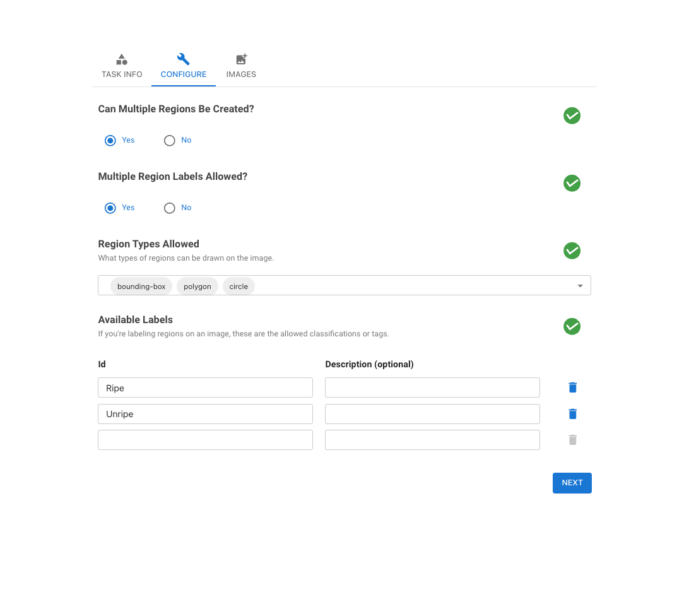
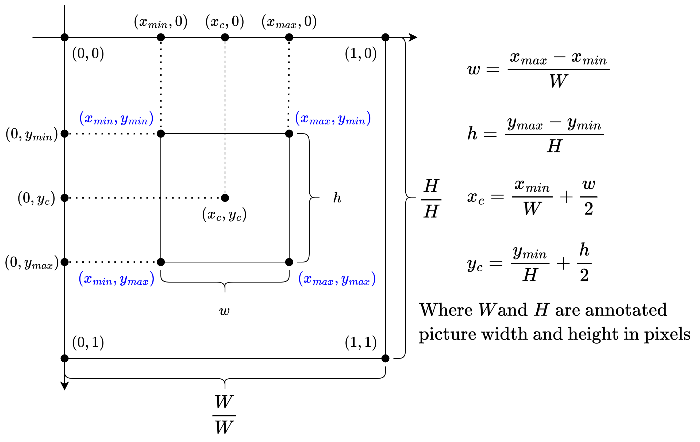

# Annotate-Lab

Annotate-Lab is an open-source application designed for image annotation, comprising two main components: the client and the server. The client, a React application, is responsible for the user interface where users perform annotations. On the other hand, the server, a Flask application, manages persisting the annotated changes and generating masked and annotated images, along with configuration settings. More information can be found in our [documentation](https://annotate-docs.dwaste.live/).

[](https://www.codetriage.com/sumn2u/annotate-lab)
[](https://github.com/sumn2u/annotate-lab/actions)
[](https://www.bestpractices.dev/projects/9112)
[](https://github.com/sumn2u/annotate-lab/actions)
[](https://github.com/sumn2u/annotate-lab/issues) [](https://github.com/sumn2u/annotate-lab/network)
[](https://github.com/sumn2u/annotate-lab/stargazers)
[](https://github.com/sumn2u/annotate-lab/blob/master/LICENSE)


# Demo [V2.0](https://github.com/sumn2u/annotate-lab/releases/tag/2.0.0)
[](https://www.youtube.com/watch?v=iUI6MKWqCeg)


<br/>


## Table of Contents
- [Project Structure](#project-structure)
- [Dependencies](#dependencies)
- [Setup and Installation](#setup-and-installation)
- [Running the Application](#running-the-application)
- [Running Tests](#running-tests)
    - [Client Tests](#client-tests)
    - [Server Tests](#server-tests)
- [Usage](#usage)
- [Outputs](#outputs)
- [Troubleshooting](#troubleshooting)
- [Contributing](#contributing)
- [License](#license)

## Project Structure [[documentation page]](https://annotate-docs.dwaste.live/overview/project-structure)
```sh

annotation-lab/
├── client/
│   ├── public/
│   ├── src/
│   ├── package.json
│   ├── package-lock.json
│   └── ... (other React app files)
├── server/
│   ├── db/
│   ├── tests/
│   ├── venv/
│   ├── app.py
│   ├── requirements.txt
│   └── ... (other Flask app files)
├── README.md
```


### Client
- **public/**: Static files and the root HTML file.
- **src/**: React components and other frontend code.
- **package.json**: Contains client dependencies and scripts.

### Server
- **db/**: Database-related files and handlers.
- **venv/**: Python virtual environment (not included in version control).
- **tests/**: Contains test files.
- **app.py**: Main Flask application file.
- **requirements.txt**: Contains server dependencies.

## Settings [[documentation page]](https://annotate-docs.dwaste.live/fundamentals/set-up-and-run/configuration)
One can configure the tools, tags, upload images and do many more from the settings.


## Dependencies [[documentation page]](https://annotate-docs.dwaste.live/overview/project-structure#dependencies)

### Client
- [React](https://react.dev/)
- [Axios](https://axios-http.com/)
- Other dependencies as listed in `package.json`

### Server
- [Flask](https://flask.palletsprojects.com/en/3.0.x/)
- [Pandas](https://pandas.pydata.org/)
- [NumPy](https://numpy.org/)
- Other dependencies as listed in `requirements.txt`

## Setup and Installation [[documentation page]](https://annotate-docs.dwaste.live/fundamentals/set-up-and-run)

### Client Setup
1. Navigate to the `client` directory:
   ```sh
   cd client
    ```
2. Install the dependencies:
    ```sh
   npm install
    ```
### Server Setup
1. Navigate to the `server` directory:
   ```sh
   cd server
    ```
2. Create and activate a virtual environment:
    ```sh
   python3 -m venv venv

   source venv/bin/activate  # On Windows use `venv\Scripts\activate`
   ```
3. Install the dependencies:
```sh
   pip install -r requirements.txt
```

## Running the Application

### Running the Client
1. Navigate to the `client` directory:
   ```sh
   cd client
    ```
2. Install the dependencies:
    ```sh
   npm start
   ```
The application should now be running on [http://localhost:5173](http://localhost:5173).


### Running the Server
1. Navigate to the `server` directory:
   ```sh
   cd server
    ```
2. Activate the virtual environment:
    ```sh
   source venv/bin/activate  # On Windows use `venv\Scripts\activate`
   ```
3. Start the Flask application:
   ```sh
   flask run
    ```
The server should now be running on [http://localhost:5000](http://localhost:5000).

### Running using Docker.
Navigate to the root directory and run the following command to start the application: 
```sh
docker-compose build
docker-compose up -d #running in detached mode
```
The  application should be running on [http://localhost](http://localhost). 

## Running Tests [[documentation page]](https://annotate-docs.dwaste.live/fundamentals/set-up-and-run/running-tests)

### Client Tests

The client tests are located in the `client/src` directory and utilize `.test.js` extensions. They are built using [Jest](https://jestjs.io/) and [React Testing Library](https://github.com/testing-library/react-testing-library).

#### Install Dependencies:

```bash
cd client
npm install
```
#### Run Tests:
```bash
npm test
```

This command launches the test runner in interactive watch mode. It runs all test files and provides feedback on test results.


### Server Tests

The server tests are located in the `server/tests` directory and are implemented using [unittest](https://docs.python.org/3/library/unittest.html).

#### Install Dependencies:

```bash
cd ../server
python -m venv venv
source venv/bin/activate # On Windows use `venv\Scripts\activate`
pip install -r requirements.txt
```
#### Run Tests:
```bash
python3 -m unittest discover -s tests -p 'test_*.py'

```

This command discovers and runs all test files (`test_*.py`) in the `server/tests` directory using unittest.

## Usage

1. Open your web browser and navigate to [http://localhost:5173](http://localhost:5173).
2. Use the user interface to upload and annotate images.
3. The annotations and other interactions will be handled by the Flask server running at [http://localhost:5000](http://localhost:5000).

## Configurations (Optional) [[documentation page]](https://annotate-docs.dwaste.live/overview/customization)
You can customize various aspects of Annotate-Lab through configuration settings. To do this, modify the `config.py` file in the `server` directory or the `config.js` file in the `client` directory.
```python
# config.py
MASK_BACKGROUND_COLOR = (0, 0, 0)  # Black background for masks
```

```Javascript
// config.js
const config = {
    SERVER_URL, // url of server
    UPLOAD_LIMIT: 500, // image upload limit
    OUTLINE_THICKNESS_CONFIG : { // outline thickness of tools
      POLYGON: 2,
      CIRCLE: 2,
      BOUNDING_BOX: 2
    },
    SHOW_CLASS_DISTRIBUTION: true // displays annotated class distribution bar chart
  };
```

## Outputs [[documentation page]](https://annotate-docs.dwaste.live/fundamentals/set-up-and-run/outputs)
Sample of annotated image along with its mask and settings is show below.


```json
{
    "orange.png": {
        "configuration": [
            {
                "image-name": "orange.png",
                "regions": [
                    {
                        "region-id": "13371375927088525",
                        "image-src": "http://127.0.0.1:5000/uploads/orange.png",
                        "class": "Print",
                        "comment": "",
                        "tags": "",
                        "points": [
                            [
                                0.5863691595741748,
                                0.7210152721281337
                            ],
                            [
                                0.6782101128815677,
                                0.6587584627896123
                            ],
                            [
                                0.7155520389516067,
                                0.5731553499491453
                            ],
                            [
                                0.7286721751383771,
                                0.40065210740699225
                            ],
                            [
                                0.7518847237765094,
                                0.352662483541882
                            ],
                            [
                                0.6862840428426572,
                                0.2307428985872776
                            ],
                            [
                                0.6045355019866261,
                                0.1581099543590026
                            ],
                            [
                                0.533888614827093,
                                0.13476365085705708
                            ],
                            [
                                0.44204766151970004,
                                0.13476365085705708
                            ],
                            [
                                0.3441512607414899,
                                0.17886222413850975
                            ],
                            [
                                0.2957076809749529,
                                0.23852499975459276
                            ],
                            [
                                0.2523103074340969,
                                0.3163460114277445
                            ],
                            [
                                0.2129498988737856,
                                0.418810343464061
                            ],
                            [
                                0.20891293389324087,
                                0.5121955574718431
                            ],
                            [
                                0.22506079381541985,
                                0.6016897208959676
                            ],
                            [
                                0.2563472724146416,
                                0.6652435470957082
                            ],
                            [
                                0.30378161093604245,
                                0.7197182552669145
                            ],
                            [
                                0.3683730506247584,
                                0.7819750646054359
                            ],
                            [
                                0.4057149766947973,
                                0.8066183849686005
                            ],
                            [
                                0.46223248642242376,
                                0.776786997160559
                            ],
                            [
                                0.5308608910916844,
                                0.7586287611034903
                            ]
                        ]
                    }
                ],
                "color-map": {
                    "Apple": [
                        244,
                        67,
                        54
                    ],
                    "Orange": [
                        33,
                        150,
                        243
                    ]
                }
            }
        ]
    }
}

```
### YOLO Format [[documentation page]](https://annotate-docs.dwaste.live/fundamentals/set-up-and-run/outputs#yolo-format)

YOLO format is also supported by A.Lab. Below is an example of annotated ripe and unripe tomatoes. The entire dataset can be found on [Kaggle](https://www.kaggle.com/datasets/sumn2u/riped-and-unriped-tomato-dataset). In this example, `0` represents ripe tomatoes and `1` represents unripe ones.


The label of the above image are as follows:
```
0 0.213673 0.474717 0.310212 0.498856
0 0.554777 0.540507 0.306350 0.433638
1 0.378432 0.681239 0.223970 0.268879
```

Applying the generated labels we get following results.


### Normalization process of YOLO annotations [[documentation page]](https://annotate-docs.dwaste.live/fundamentals/set-up-and-run/outputs#normalization-process-of-yolo-annotations)

#### Example Conversion

To convert non-normalized bounding box coordinates (x<sub style="font-size: 0.8em;">max</sub>, y<sub style="font-size: 0.8em;">max</sub>, x<sub style="font-size: 0.8em;">min</sub>, y<sub style="font-size: 0.8em;">min</sub>) to YOLO format (x<sub style="font-size: 0.8em;">center</sub>, y<sub style="font-size: 0.8em;">center</sub>, <span style="font-variant: small-caps;">width</span>, <span style="font-variant: small-caps;">height</span>):



Image Credit: Leandro de Oliveira
```python
# Assuming row contains your bounding box coordinates
row = {'xmax': 400, 'xmin': 200, 'ymax': 300, 'ymin': 100}
class_id = 0  # Example class id (replace with actual class id)

# Image dimensions
WIDTH = 640  # annotated image width
HEIGHT = 640  # annotated image height

# Calculate width and height of the bounding box
width = row['xmax'] - row['xmin']
height = row['ymax'] - row['ymin']

# Calculate the center of the bounding box
x_center = row['xmin'] + (width / 2)
y_center = row['ymin'] + (height / 2)

# Normalize the coordinates
normalized_x_center = x_center / WIDTH
normalized_y_center = y_center / HEIGHT
normalized_width = width / WIDTH
normalized_height = height / HEIGHT

# Create the annotation string in YOLO format
content = f"{class_id} {normalized_x_center} {normalized_y_center} {normalized_width} {normalized_height}"
print(content)
``` 
The above conversion will give us YOLO format string.
```txt
0 0.46875 0.3125 0.3125 0.3125
```

## Troubleshooting [[documentation page]](https://annotate-docs.dwaste.live/troubleshooting)

- Ensure that both the client and server are running.
- Check the browser console and terminal for any errors and troubleshoot accordingly.
- Verify that dependencies are correctly installed.

## Contributing

If you would like to contribute to this project, please fork the repository and submit a pull request. For major changes, open an issue first to discuss your proposed changes. Additionally, please adhere to the [code of conduct](CODE_OF_CONDUCT.md). More information about contributing can be found [here](./CONTRIBUTING.md).

## License

This project is licensed under the [MIT License](./LICENSE).

## Acknowledgment

This project is detached from idapgroup [react-image-annotate](https://github.com/idapgroup/react-image-annotate/commit/d35c761ac748ed690c67575002a820843672cde9) and uses some work from [image_annotator](https://github.com/gnamiro/image_annotator/tree/master). 
