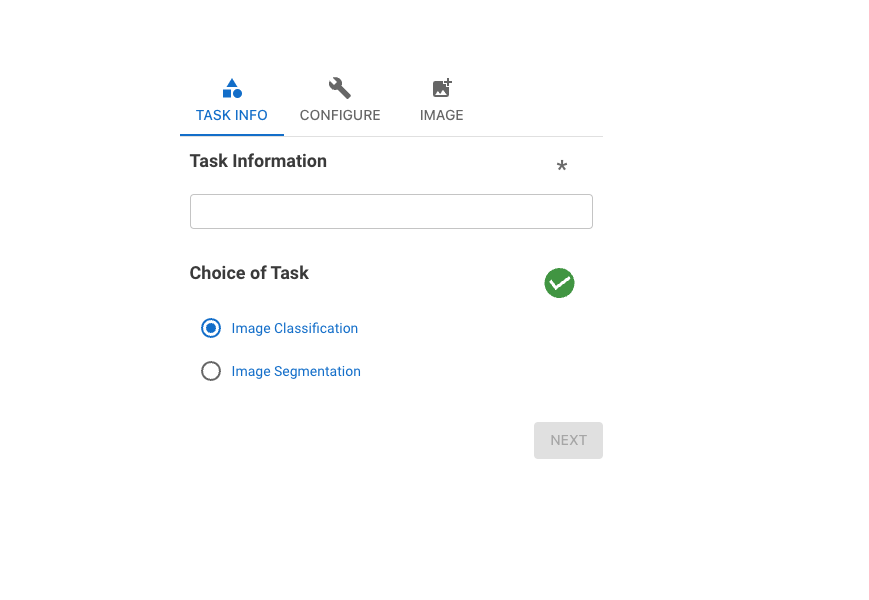
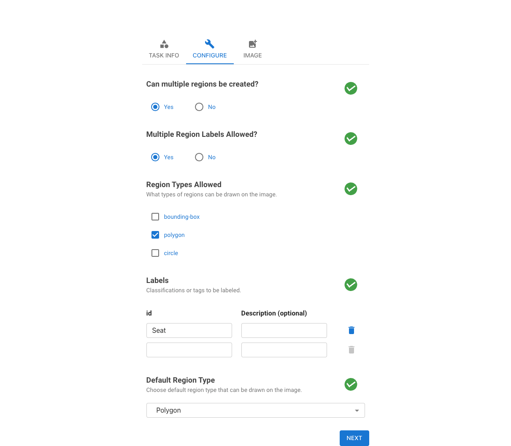
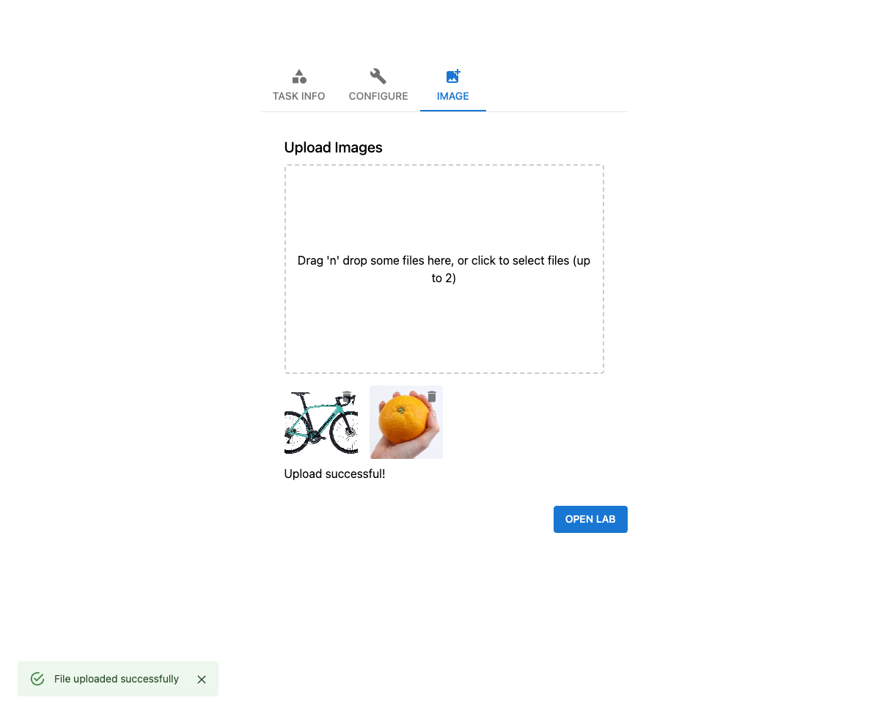
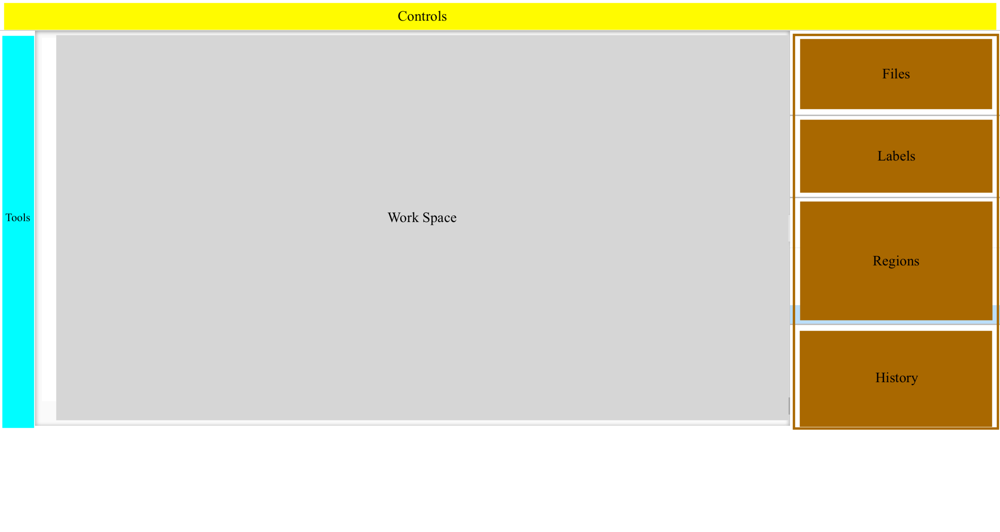
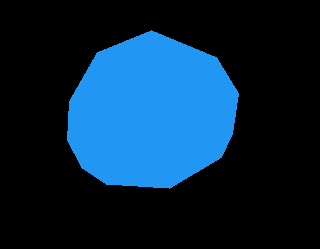

# Documentation

## 1. Introduction
Annotate-Lab is an open-source application designed for image annotation, comprising two main components: the client and the server. The client, a React application, is responsible for the user interface where users perform annotations. On the other hand, the server, a Flask application, manages persisting the annotated changes and generating masked and annotated images, along with configuration settings. The preview of Annotate Lab interface is shown below.


### Key Features
- Easy image upload and annotation
- Supports multiple annotation types
- User-friendly interface
- Configurable settings

Based on the region tools selected in settings, users can annotate images. The labels are configured in settings along with the images. After annotation is performed, users can download the annotated image, annotation settings, and masked images from the download button. The history section on the right sidebar displays the actions performed, which can be reverted. Meanwhile, the regions section shows the annotated regions that can be locked, deleted, or hidden.

The images section displays the number of images, while the classifications section shows the available labels.

## 2. Table of Contents
- [Project Structure](#project-structure)
- [Dependencies](#dependencies)
- [Setup and Installation](#setup-and-installation)
- [Running the Application](#running-the-application)
- [Configuration](#configuration)
- [Usage](#usage)
- [Troubleshooting](#troubleshooting)
- [Contributing](#contributing)
- [License](#license)
- [Acknowledgments](#acknowledgments)
- [FAQ](#faq)
- [Contact](#contact)

##  3. Project Structure

The tree structure of project is shown below.  
```sh

annotation-lab/
├── client/
│   ├── public/
│   ├── src/
│   ├── package.json
│   ├── package-lock.json
│   └── ... (other React app files)
├── server/
│   ├── db/
│   ├── venv/
│   ├── app.py
│   ├── requirements.txt
│   └── ... (other Flask app files)
├── README.md
```

### Client
- **public/**: Static files and the root HTML file.
- **src/**: React components and other frontend code.
- **package.json**: Contains client dependencies and scripts.

### Server
- **db/**: Database-related files and handlers.
- **venv/**: Python virtual environment (not included in version control).
- **app.py**: Main Flask application file.
- **requirements.txt**: Contains server dependencies.


## 4. Dependencies

### Client
- React
- Axios
- Other dependencies as listed in `package.json`

### Server
- Flask
- Flask-CORS
- pandas
- Other dependencies as listed in `requirements.txt`

## 5. Setup and Installation

### Client Setup
1. Navigate to the `client` directory:
   ```sh
   cd client
    ```
2. Install the dependencies:
    ```sh
   npm install
    ```
### Server Setup
1. Navigate to the `server` directory:
   ```sh
   cd server
    ```
2. Create and activate a virtual environment:
    ```sh
   python3 -m venv venv

    source venv/bin/activate  # On Windows use `venv\Scripts\activate`
    ```
3. Install the dependencies:
```sh
   pip install -r requirements.txt
```


## 6. Running the Application

### Running the Client
1. Navigate to the `client` directory:
   ```sh
   cd client
    ```
2. Install the dependencies:
    ```sh
   npm start
   ```
The application should now be running on [http://localhost:5173](http://localhost:5173).


### Running the Server
1. Navigate to the `server` directory:
   ```sh
   cd server
    ```
2. Activate the virtual environment:
    ```sh
   source venv/bin/activate  # On Windows use `venv\Scripts\activate`
   ```
3. Start the Flask application:
   ```sh
   flask run
    ```
The server should now be running on [http://localhost:5000](http://localhost:5000).

### Running using Docker.
First, change the `VITE_SERVER_URL` to  `http://127.0.0.1:8080`.
Then, navigate to the root directory and run the following command to start the application: 
```sh
docker-compose build
docker-compose up -d #running in detached mode

```

## 7. Configuration
One can configure the tools, tags, upload images, and more from the settings. Initially, we need to provide the task information, where we can select the task type.



After providing the above information, we will be navigated to the configuration tab where we provide the tools, labels, and region types information.



Following this, we will be navigated to the image tab where we provide the images that need annotation.

 

Once everything is configured, we click "Open Lab" to access the annotation lab, where the configurations that we set will be utilized.


## 8. Usage

### Annotating Images

The blueprint of the annotate lab and example of bicycle annotation is shown below. 




At the top, users will find details about the uploaded image, along with a download button on the right side, enabling them to download the annotated image, its settings, and the masked image. The "prev" and "next" buttons navigate through the uploaded images, while the clone button replicates the repository. To preserve their current work, users can use the save button, which saves their progress. Finally, the exit button allows users to exit the application.


The left sidebar (tools) contains sets of tools available for annotation, sourced from the configuration that was set up. The "Select," "Drag/Pan," "Zoom In/Out," and "Show/Hide Tags" are present by default.

The right sidebar contains four sections: files, labels, regions, and history. The files section lists the uploaded images and allows users to navigate and save current stage changes. The labels section contains the list of labels, enabling users to select their desired label to apply it to the annotated region. The regions section lists annotated regions, where users can delete, lock, or hide selected regions. The history section shows action histories and offers a revert functionality to undo changes.

Between the left and right sidebars, there's a workspace section where the actual annotation takes place. Sample of annotated image  along with its mask and settings is show below.




```json
{
   "configuration":[
      {
         "image-name":"orange.png",
         "regions":[
            {
               "region-id":"47643630436867834",
               "image-src":"http://127.0.0.1:5000/uploads/orange.png",
               "class":"Orange",
               "comment":"",
               "tags":"",
               "points":[
                  [
                     0.4685613390092879,
                     0.7693498452012384
                  ],
                  [
                     0.6781491873065015,
                     0.6640866873065016
                  ],
                  [
                     0.723921246130031,
                     0.5092879256965944
                  ],
                  [
                     0.7480118034055728,
                     0.34055727554179566
                  ],
                  [
                     0.5841960139318886,
                     0.14705882352941177
                  ],
                  [
                     0.41917569659442727,
                     0.13312693498452013
                  ],
                  [
                     0.30113196594427244,
                     0.22755417956656346
                  ],
                  [
                     0.21079237616099072,
                     0.4411764705882353
                  ],
                  [
                     0.26620065789473685,
                     0.6764705882352942
                  ],
                  [
                     0.4011077786377709,
                     0.7879256965944272
                  ]
               ]
            },
            {
               "region-id":"5981359766055432",
               "image-src":"http://127.0.0.1:5000/uploads/orange.png",
               "class":"Apple",
               "comment":"",
               "tags":"",
               "x":[
                  0.1770655959752322
               ],
               "y":[
                  0.11764705882352941
               ],
               "w":[
                  0.5854005417956657
               ],
               "h":[
                  0.6981424148606811
               ]
            }
         ]
      }
   ]
}

```

## 9. Troubleshooting

- Ensure that both the client and server are running.
- Check the browser console and terminal for any errors and troubleshoot accordingly.
- Verify that dependencies are correctly installed.


## 10. Contributing

We welcome contributions to the Annotate-Lab project! Here are some ways you can contribute:

### Reporting Bugs
If you encounter any bugs or issues while using Annotate-Lab, please report them by opening an issue in the GitHub repository. Include detailed information about the problem and steps to reproduce it.

### Suggesting Features
If you have ideas for new features or improvements, we would love to hear them! Please open an issue in the GitHub repository and describe your suggestion in detail.

### Submitting Pull Requests
1. **Fork the Repository**: Click the "Fork" button at the top right corner of the repository page to create a copy of the repository on your GitHub account.
2. **Clone the Forked Repository**: Clone the repository to your local machine using the following command:
    ```sh
    git clone https://github.com/your-username/annotate-lab.git
    ```
3. **Create a New Branch**: Create a new branch for your feature or bug fix:
    ```sh
    git checkout -b feature/your-feature-name
    ```
4. **Make Changes**: Make your changes in the new branch. Ensure that your code follows the project's coding standards and includes appropriate tests.
5. **Commit Changes**: Commit your changes with a descriptive commit message:
    ```sh
    git commit -m "Add feature: your feature name"
    ```
6. **Push Changes**: Push your changes to your forked repository:
    ```sh
    git push origin feature/your-feature-name
    ```
7. **Create a Pull Request**: Open a pull request from your forked repository's branch to the `main` branch of the original repository. Provide a detailed description of your changes and the motivation behind them.

### Code of Conduct
Please note that this project is governed by a [Code of Conduct](../CODE_OF_CONDUCT.md). By participating, you are expected to uphold this code.

### Documentation Improvements
You can also contribute by improving the documentation. If you find any inconsistencies or areas that need clarification, please submit a pull request with your changes.

## 11. License
This project is licensed under the MIT License.

## 12. Acknowledgments
This project uses some parts of the work from idapgroup [react-image-annotate](https://github.com/idapgroup/react-image-annotate) and [image_annotator](https://github.com/gnamiro/image_annotator/tree/master).

## 13. FAQ

### Q1: How do I add new labels?
**A1:** You can add new labels in the configuration settings under the "Available Labels" section.

### Q2: Can I annotate multiple regions in one image?
**A2:** Yes, you can annotate multiple regions. Ensure that the "Can multiple regions be created?" option is enabled in the settings.

### Q3: How do I run the application in production?
**A3:** For production, it is recommended to use Docker to build and deploy the application. Follow the Docker setup instructions provided.

## 14. Contact
For further support or inquiries, please contact [sumn2u[at]gmail.com](mailto:sumn2u@gmail.com).
